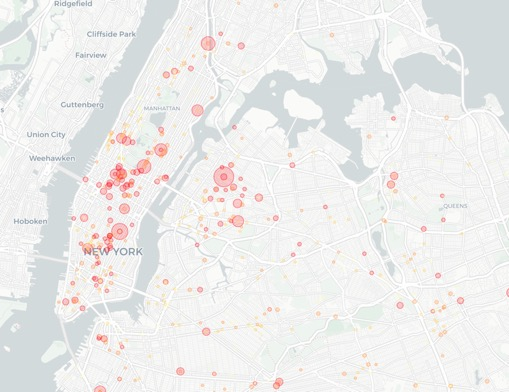
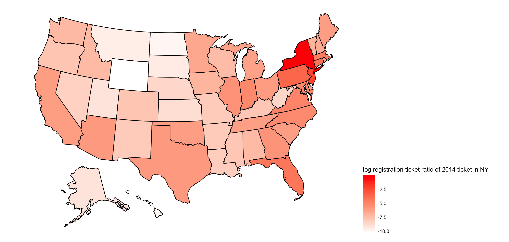
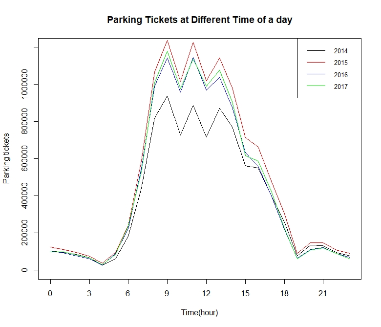
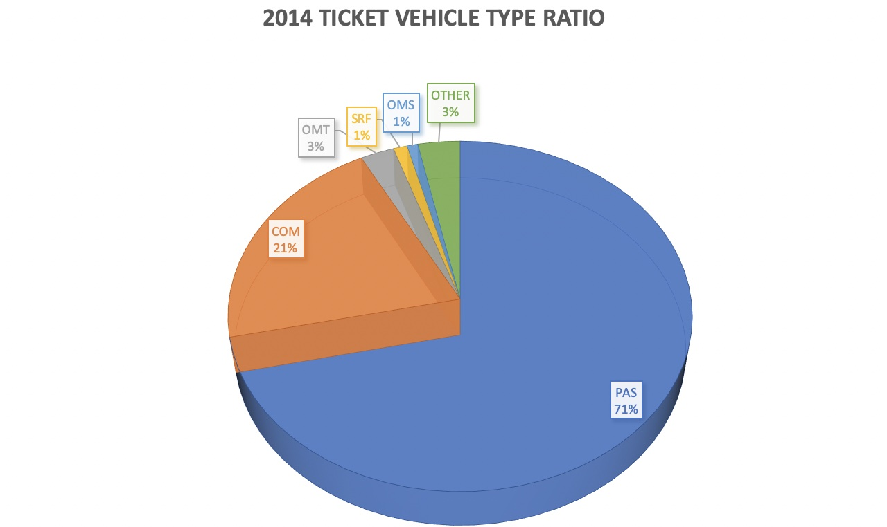
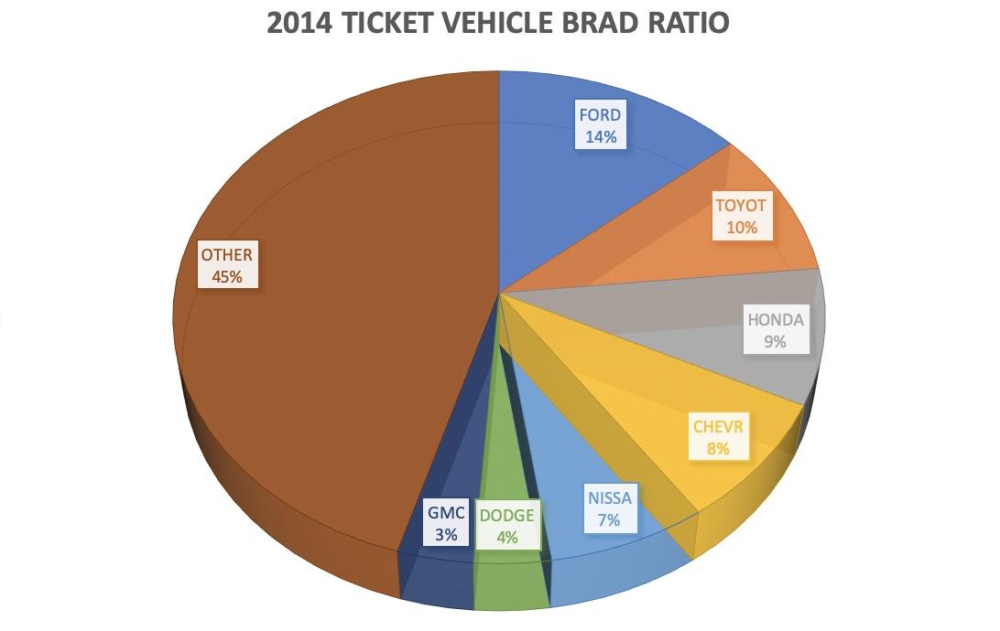

# STAT 605 Final Project, Group8

## Introduction 

We analyzed 42.3 millions of Parking Ticket Data, from Aug, 2013 to June 2017. The dataset contains 4 huge .csv files, and has a total size of 8 GB. Each .csv file contains information related to where, when and by which vehicle the violations occur.  

We tried to figure out these questions:  

1. Do any specific streets have more violations?  
2. Which State's car cause more violations?  
3. When do more violations occurs?  
4. Which type of vehicle committed more violations?   
5. Which brand of vehicle committed more violations?  

We split the 4 huge .csv files, and conducted parallel computation in CHTC. It will be described in detail in following part.  

## Body

### Data Description

The dataset we use is from Kaggle (https://www.kaggle.com/new-york-city/nyc-parking-tickets/). You can also download the file through filemail link (https://fil.email/tEeuxVK7).  

The dataset contains 4 .csv files, and has a total size of 8GB.  

For each .csv file, it contains (but not limited to) these key variables:  
*Plate ID* : Plate ID of the violation car.  
*Registration State* : Which state issued the vehicle.  
*Plate Type*: Commecial vehicle, Agricultural vehicle.  
*Vehicle Body Type*: which type of vehicle body type is, eg. Suburban, two-door sedan (2DSD) and four-door sedan (4DSD).  
*Vehicle Make*: which brand is the vehicle, eg. Ford, Toyota.  
*Streetname* : In which street did the violation happen.  
*latitude, longitude* : Where did the violation happen(can be used to draw on map).  

### Statistical Computation

For the dataset is huge, but what we want to analyze is not complicated, so we chose to use *CHTC* to conducted parallel computation.  

The main process of parallel computation is:   

*download dataset* $\rightarrow$ *cut the big .csv file into small pieces* $\rightarrow$ *conducted parallel computation through CHTC* $\rightarrow$ *merge the separate results*

For the download dataset part, we used a *wget* command to download data from filemail, avoiding to upload the big file to CHTC after downloading from Kaggle. For the *cut big .csv into small pieces* part, we used an $.sh$ file to cut the file into small ones, so we can use CHTC to do analysis parallely. For the *conducted parallel computation through CHTC*, we used CHTCondor to do parallel computation. Afterwards, we *merge* the results through R.  

## Conclusion 

### Results

1. Do any specific streets have more violations?  

For this questions, we analyzed the geographic information of violations, and then made plots of NYC map, with high-risk street marked by larger and red cicle.  The area of circles are proportional to the number of ticket.

{ width=80% }

We can seen that the center of New York and Queens are more violation area. This result is reasonable since they are busy districts.

2. Which State's car cause more violations?  

For summarized the frequency of violations with respect to register states, and maked made a US map with different color on each state, the deeper the color is, the more violations from vechiles registered in the state.  

{ width=80% }

We can seen that most ticket vehicle are from the neighborhood of New York States, East coast, Texas and California. This result is reasonable since some are next to NYC, and some are rich and big states.

3. When do more violations occurs?  

For this question, we conducted a time-series analysis, and made plots of how many violations occurs with respect to time in a day.  

{ width=60% }

We can see that the main violation happens in daytime(worktime), since parking lot are almost full and another reason may be that traffic police also work at this time.

4&5. Which type and which brand of vehicle committed more violations?  

For this question, we just simply made some pie plots to show vehicles of which type and which brand committed more violations.  

{ width=60% } { width=47% }

Most ticket vehicle brand are Ford, Toyota and Honda which are popular car types. Major vehicle type is passenger vehicle, since they are usually most widely car type in the city.

### Future work

We can only find the data for the latest 4 years, maybe in the future we can collect more data including many years and complex time series model can be applied. Moreover, by analysis the vehicle type, brand from more years, we may find trend of vehicle use, like passenger vehicle are becoming more common, and a specific brand gets popular in a year.

If we can get the population data, namely, including the vehecles not having a violation, for example, vehicles entered or in the city from the DMV and highway toll station, we can do t-test to see whether a specific region more likely leads to a violation. 
